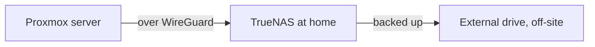
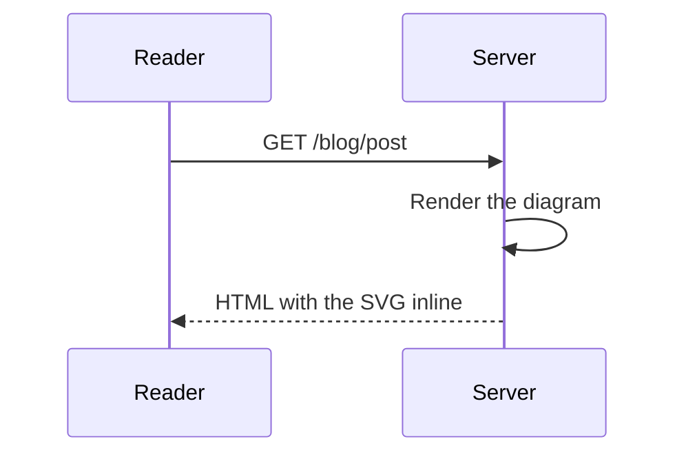
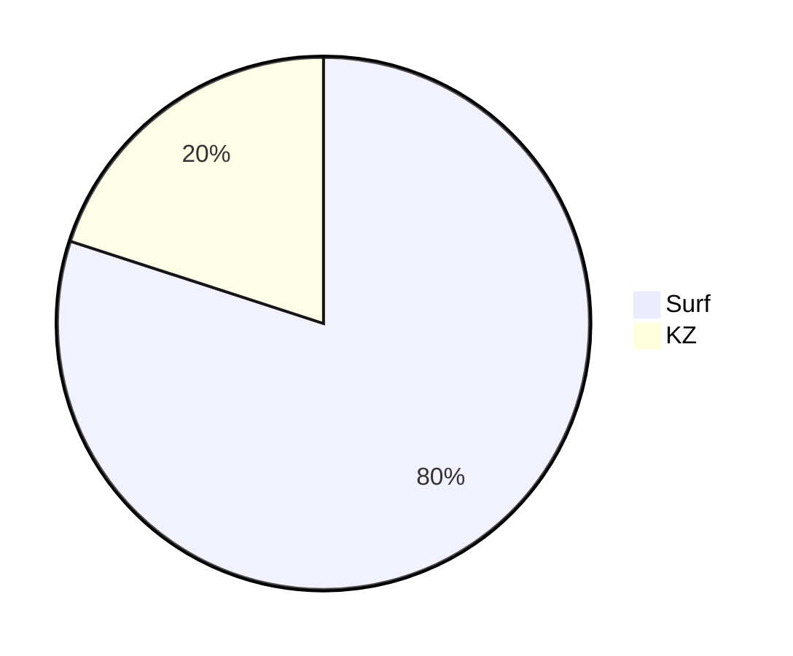

Every feature an author can use, exercised once. This post is permanently
`draft: true`, so it renders at its own URL without appearing in listings, the
feed, or the sitemap. Its frontmatter uses **every** supported key.

## Frontmatter

Only `title` and `date` are required. This file sets all of them:

| Key | This post | Notes |
| --- | --- | --- |
| `title` | `Authoring Reference` | Required. The `<h1>` and the `<title>` |
| `date` | `2026-08-18` | Required. Sorts the archive; a future date schedules the post |
| `updated` | `2026-08-21` | Shows a revision line, sets `dateModified` |
| `image` | `cover-demo.png` | Cover, under `media/`. Raster only, see below |
| `tags` | four of them | The only taxonomy: filter chips plus `keywords` |
| `excerpt` | overridden | Derived from the first paragraph when omitted |
| `readTime` | `12 min read` | Derived from the word count when omitted |
| `draft` | `true` | Keeps it out of every listing, still reachable |
| `toc` | `true` | Forces this Contents block; `false` suppresses it |

`excerpt` and `readTime` are set here only to prove an override wins. Leave both
out and the pipeline derives them from the body, ignoring fenced code.

<Callout type="warn" title="Cover images must be raster">
  A cover goes through `next/image`, and SVG optimisation is disabled, so an
  `.svg` cover returns a 400 and renders nothing. Use `.png`, `.jpg`, or
  `.webp` for `image:`. Inline body images have no such limit.
</Callout>

## Text

**Bold**, _italic_, **_bold italic_**, `inline code`, and ``code with a ` tick``.
Strikethrough works with two tildes, ~~like this~~, and with one, ~like this~.

Backslashes escape the markers, so \*this stays literal\* and \_so does this\_.

A line ending in a backslash breaks hard,\
so this sentence starts on its own line inside the same paragraph.

## Links

- Internal: [the blog index](/blog) and [a tag view](/blog?tag=mdx)
- External: [react.dev](https://react.dev), which opens in a new tab
- Explicit mail: [say hello](mailto:hello@example.com)
- Bare autolinks: https://nextjs.org, www.typescriptlang.org, hello@example.com
- Blocked scheme: [this one](javascript:alert(1)) renders as text with no link

Every link is rewritten to carry `rel="noopener noreferrer nofollow ugc"`, and
only `http`, `https`, and `mailto` survive. Fragments stay in the tab, so a
[jump to the tables below](#tables) behaves normally.

## Images

A plain Markdown image, sized from the file on disk so nothing shifts as it
loads:


`Figure` adds a caption:

<Figure
  src="/media/images/blog/inline-demo.svg"
  alt="The same image, captioned"
  caption="A caption sits under the image, centred and muted."
/>

Without `caption` it is just a block-level image with figure spacing:

<Figure src="/media/images/blog/cover-demo.png" alt="The cover image, inline" />

Images must be same-origin, under `media/`. An off-site `src` renders nothing
at all rather than leaking a request:


## Lists

Unordered, with nesting:

- A first item
- A second item
  - Nested one level
    - And another
- Back to the top level

Ordered lists keep their numbering, and can start anywhere:

3. Numbering starts at three
4. Because the first marker says so
5. The rest follow

Task lists render disabled checkboxes, with no doubled bullet:

- [x] A finished thing
- [ ] An unfinished thing
- [ ] A parent item
  - [x] With a nested finished child

A loose list, where blank lines between items make each one a paragraph:

- The first item, which the renderer wraps in its own paragraph.

- The second item, spaced further from the first.

## Quotes

> A blockquote for a longer passage. It wraps like any other block and can
> contain **inline formatting** and [links](/blog).
>
> > A nested quote sits one level deeper.

## Tables

The separator row sets alignment: default, centred, right.

| Feature | Syntax | Support |
| --- | :---: | ---: |
| Tables | `\| a \| b \|` | **Yes** |
| Footnotes | `[^ref]` | _Yes_ |
| Task lists | `- [x]` | `Yes` |
| Autolinks | bare URL | Yes |

## Footnotes

A reference renders a superscript link to a definition collected at the end of
the post, with a back-reference arrow.[^one] Two references to the same note
collapse into one definition.[^one] A second note gets its own entry.[^two]

## Code

A fence with a language tag:

```ts
// Nothing inside a fence is parsed as Markdown: this # is not a heading,
// and the *asterisks* stay literal.
const { content } = await compileMDX({ source, ...mdxRenderProps });
```

Colors follow the theme toggle, and every block has a copy button in its
top-right corner (with a mouse, it appears on hover). A language tag the
highlighter doesn't know renders as plain text.

Line numbers in braces after the language, such as `{2}` or `{1,3-4}`,
highlight those lines:

```ts {2}
const theme = useTheme();
const isDark = theme === 'dark';
const label = isDark ? 'Light mode' : 'Dark mode';
```

A `[!code ++]` or `[!code --]` comment, written in the language's own comment
syntax, marks an added or removed line. The marker comment itself is not shown:

```yaml
services:
  web:
    image: portfolio:0.2.0 # [!code --]
    image: portfolio:0.3.0 # [!code ++]
```

A fence with no language, for plain output:

```
$ npm run check:content
No problems found.
```

Tilde fences work too, which is how you show a backtick fence:

~~~md
```ts
const nested = true;
```
~~~

---

That horizontal rule came from three dashes.

## Callouts

Three types, each with an icon and a semantic colour.

<Callout>The default, written with no attributes.</Callout>

<Callout type="note">The same thing, said explicitly.</Callout>

<Callout type="tip">
  `type="tip"` for something worth doing but optional.
</Callout>

<Callout type="warn">`type="warn"` for a footgun.</Callout>

<Callout type="bogus">
  An unknown `type` falls back to a note, so a typo costs a colour and not the
  post.
</Callout>

<Callout type="tip" title="Custom label">
  `title` replaces the default label when the type name is not the word you
  want.
</Callout>

## Components

The site's own server components are available in a body. `Surface` is the
frosted reading panel:

<Surface>A nested panel, set apart from the surrounding prose.</Surface>

`Container` applies the standard page width and padding:

<Container size="sm">A narrower block, centred like a page.</Container>

`EmptyState` is the dashed placeholder:

<EmptyState>Nothing here yet.</EmptyState>

`IconBadge` is the circular chip, in two colours, two sizes, and two shapes:

<IconBadge>1</IconBadge>
<IconBadge color="secondary" size="lg">
  2
</IconBadge>
<IconBadge shape="xl">3</IconBadge>

`PostMeta` is the date row used on the blog cards:

<PostMeta date="2026-08-18" readTime="12 min read" updated="2026-08-21" />

`CoverCard` is the overlay card, and needs an `href`, a `coverImage`, a title, a
description, and a `sizes` hint:

<CoverCard
  href="/blog"
  coverImage="/media/images/blog/cover-demo.png"
  title="A cover card"
  description="Links somewhere, fills its own aspect ratio."
  sizes="(max-width: 768px) 100vw, 768px"
  aspect="aspect-video"
/>

`CoverImage` fills its parent, so it needs a sized, positioned wrapper.
Without one it collapses to nothing:

<div className="relative aspect-video overflow-hidden rounded-2xl not-prose">
  <CoverImage
    src="/media/images/blog/cover-demo.png"
    alt="A cover image inside a sized wrapper"
    sizes="(max-width: 768px) 100vw, 768px"
  />
</div>

`not-prose` on a wrapper opts its subtree out of the typography styles, which is
what keeps a component's own spacing intact.

## Charts and diagrams

All four render on the server from the MDX itself, so they follow the theme
toggle, reflow on a phone, and ship no JavaScript. Props are strings, since
expressions are stripped, so a chart's data goes in child elements.

### Stat tiles

<Stats>
  <Stat value="1.25M+" label="unique players" note="since October 2015" />
  <Stat value="~200" label="countries and territories" />
  <Stat value="10" label="years online" />
</Stats>

`value` renders exactly as written, and `note` is optional. Tiles take one
column on a phone, two on a tablet, and one each, up to four, on a desktop.

### Bar charts

<BarChart title="Active players per year" note="2026 runs through September.">
  <Bar label="2019" value="380,875" show />
  <Bar label="2023" value="185,566" show />
  <Marker after="2023" label="CS2 released" note="September 2023" />
  <Bar label="2024" value="6,137" show />
</BarChart>

Each `<Bar>` takes a `label` and a `value`, commas allowed. Columns are the
default, and only bars marked `show` print their value. `<Marker after="2023">`
draws a labelled rule after the bar with that label. Every chart has a table of
its numbers under it.

<BarChart title="Hours played by game mode" orientation="horizontal">
  <Bar label="Surf" value="2380786" />
  <Bar label="KZ" value="581741" />
</BarChart>

`orientation="horizontal"` gives one row per bar with every value at its tip.
Once a bar reaches a million, the whole chart switches to `2.38M` style.

### Timelines

<Timeline>
  <Milestone date="October 2015" title="First servers" />
  <Milestone date="2019" title="Peak year">380,875 active players.</Milestone>
  <Milestone date="September 2023" title="CS2 released">
    Most servers went quiet within the month. The **KZ** servers kept a
    [steady crowd](/blog).
  </Milestone>
</Timeline>

Children are optional and take ordinary Markdown.

### Diagrams

A fence with the language `mermaid` becomes a diagram:



~~~md

~~~

Flowcharts, state, sequence, class, and ER diagrams are supported:



Screen readers get a diagram's labels but not its shape, so say what it shows
in the prose around it. A diagram wider than the column scrolls sideways rather
than shrinking its text.

## Headings and the table of contents

`##` and `###` headings become Contents entries and get anchor ids from their
text. Hovering one shows a `#` link to it, for sharing a section.

### A third-level heading

Indented one level in the Contents block above.

#### A fourth-level heading

`####` and deeper render normally but never appear in the Contents. Four or more
`##`/`###` headings adds the block automatically; `toc: true` or `toc: false`
overrides the count either way.

## What deliberately does not work

Authored HTML is filtered rather than rendered. Everything on the next four
lines is in the source of this file and produces nothing:

<script>alert('never runs')</script>
<iframe src="https://example.com"></iframe>
<input type="text" value="never renders" />
<style>{`body { display: none }`}</style>

Event handlers are stripped from tags that are otherwise allowed, so this div
renders its text and nothing else:

<div onclick="alert('stripped')">A div whose onclick was removed.</div>

An authored `<a>` or `` does survive, rewritten through the same hardened
components as their Markdown equivalents:

<a href="https://example.com" rel="opener">
  An authored anchor, with its rel attribute replaced.
</a>

JavaScript expressions are not evaluated either. A brace expression is dropped
outright, inline or on its own line, so no post can execute code. Write the
braces inside a code span to show them at all: `{2 + 2}` stays four characters
and never becomes `4`.

Client components are not exposed at all. `GalleryView`, `ShareButton`, and the
rest would ship JavaScript for every post that mentioned them. The code blocks'
copy button is the only script a post body brings.

A Mermaid diagram type the renderer doesn't support, or a first line it can't
read, shows the source as a code block instead:



Inside a diagram, a line the renderer can't read is dropped without a warning,
so check that every node and edge made it onto the page.

A chart value that isn't a number replaces the chart with an error naming the
bar, rather than breaking the post:

<BarChart title="A typo">
  <Bar label="2019" value="38O,875" />
</BarChart>

[^one]: The first footnote. Definitions can sit anywhere in the file; they are
    always collected here, in reference order.

[^two]: The second footnote, proving the list numbers itself.
